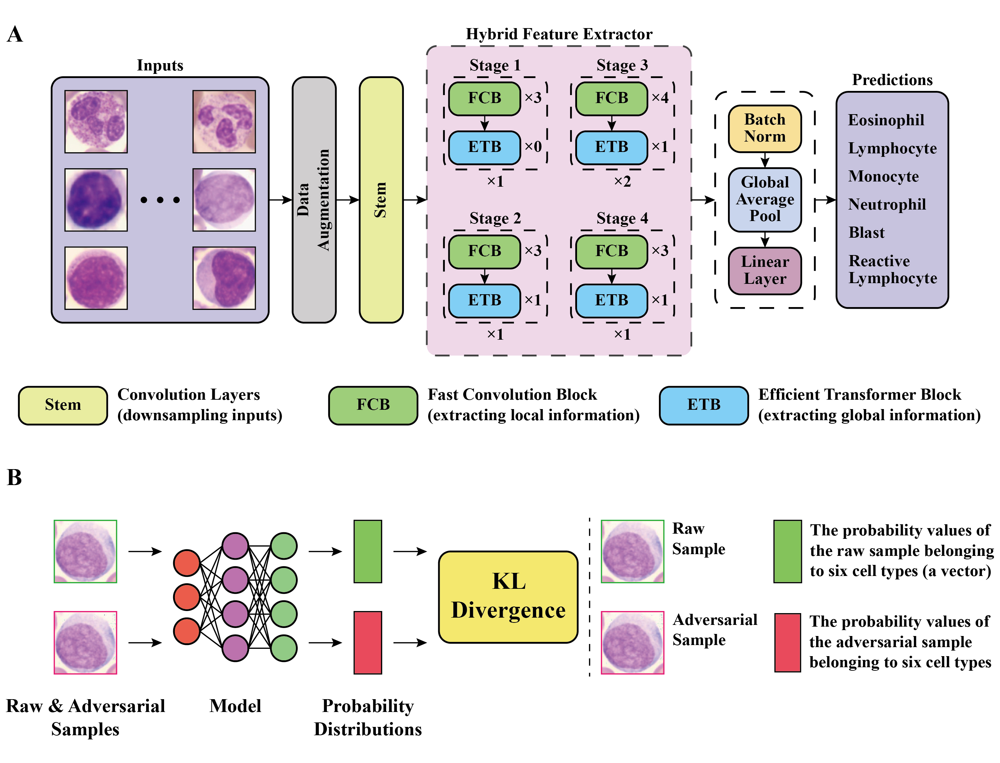

# Adversarial Training Collaborating Hybrid Convolution-Transformer Network for Automatic Identification of Reactive Lymphocytes in Peripheral Blood
⭐ This code has been completely released ⭐ 

⭐ our [article]() ⭐ 

If our code is helpful to you, please cite:
```
```
<p align="center">  </p>

## Requirements
Install PyTorch
```
# CUDA 10.2
conda install pytorch==1.10.0 torchvision==0.11.0 torchaudio==0.10.0 cudatoolkit=10.2 -c pytorch

# CUDA 11.3
conda install pytorch==1.10.0 torchvision==0.11.0 torchaudio==0.10.0 cudatoolkit=11.3 -c pytorch -c conda-forge
```
Install remaining packages
```
pip install -r requirements.txt
```
## Train
### 1. Prepare training data
- The download link for out dataset is [here](https://pan.baidu.com/s/1-raJiW7a3Es0MFk-5VMKqQ?pwd=wf5f).
```
PBC
├── train
│   ├── e
│   │   ├── 0001.jpg
│   │   ├── 0002.jpg
│   │   ├── .....
│   ├── l
│   ├── m
│   ├── n
│   ├── nbl
│   ├── vl
├── val
├── test
```
### 2. Begin to train
```
bash train.sh --model nextvit_small --batch-size 32 --lr 3e-4 --warmup-epochs 0 -weight-decay 1e-8 --epochs 100 --sched step --decay-epochs 80 --input-size 224 -resume ../checkpoints/nextvit_small_in1k_224.pth --finetune --data-path
your_imagenet_path
```
## Test
### 1. Begin to test
```
bash train.sh --model nextvit_small --batch-size 32 --lr 3e-4 --warmup-epochs 0 --weight-decay 1e-8 --data-path your_dataset_path --resume ../checkpoints/your_checkpoints_path --eval
```
## Results
### 1. Validation set
|   **Methods**           |   **P(%)**  |   **R(%)**  |  **F1(%)**  |  **Images** |
|:-----------------------:|:-----------:|:-----------:|:-----------:|:-----------:|
| **Eosinophil**          |    98.04    |    83.33    |    90.09    |     60      |
| **Lymphocyte**          |    88.71    |    93.83    |    91.20    |     519     |
| **Monocyte**            |    92.08    |    90.57    |    91.32    |     244     |
| **Neutrophil**          |    98.28    |    99.59    |    98.93    |     975     |
| **Blast**               |    92.59    |    87.55    |    90.00    |     257     |
| **Reactive Lymphocyte** |    93.17    |    90.17    |    91.54    |     447     |
### 2. Test set
|   **Methods**           |   **P(%)**  |   **R(%)**  |  **F1(%)**  |  **Images** |
|:-----------------------:|:-----------:|:-----------:|:-----------:|:-----------:|
| **Eosinophil**          |    97.67    |    91.30    |    94.38    |     46      |
| **Lymphocyte**          |    90.22    |    92.06    |    91.13    |     491     |
| **Monocyte**            |    94.00    |    89.10    |    91.48    |     211     |
| **Neutrophil**          |    98.95    |    99.16    |    99.05    |     947     |
| **Blast**               |    93.63    |    89.02    |    91.26    |     264     |
| **Reactive Lymphocyte** |    84.65    |    88.03    |    86.31    |     376     |
## Acknowledgements
This code is built on [Next-ViT](https://github.com/bytedance/Next-ViT). We thank the authors for sharing the codes.